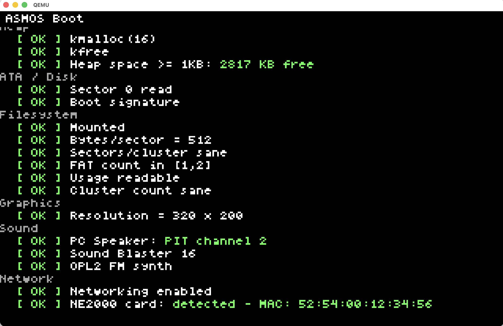
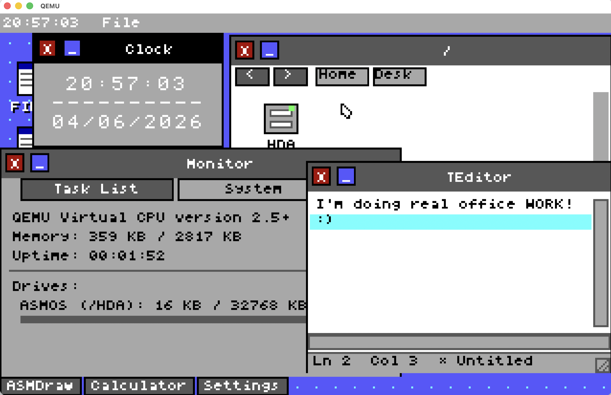
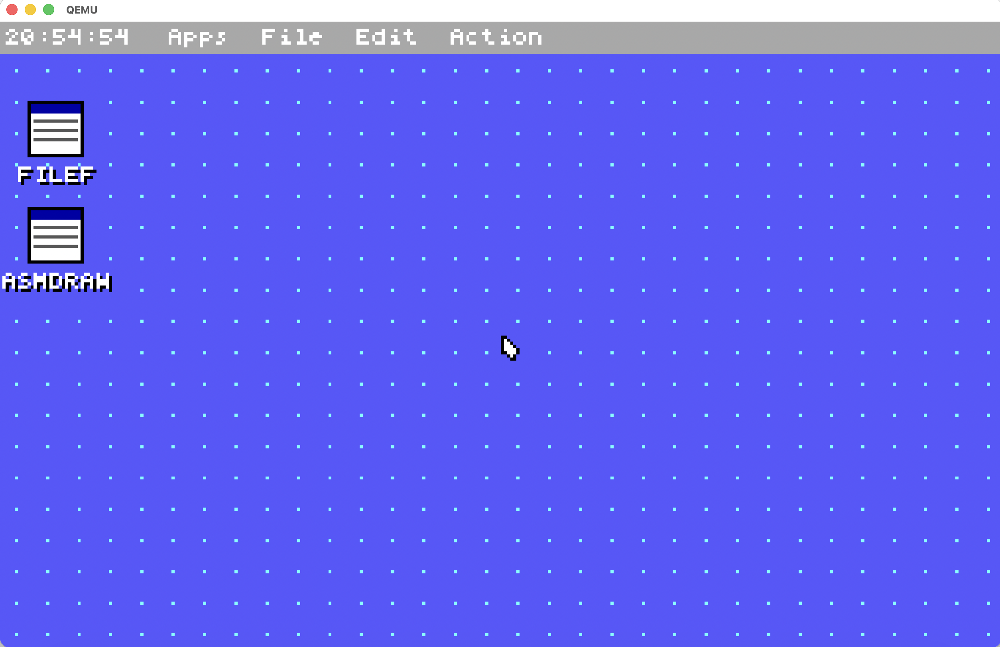
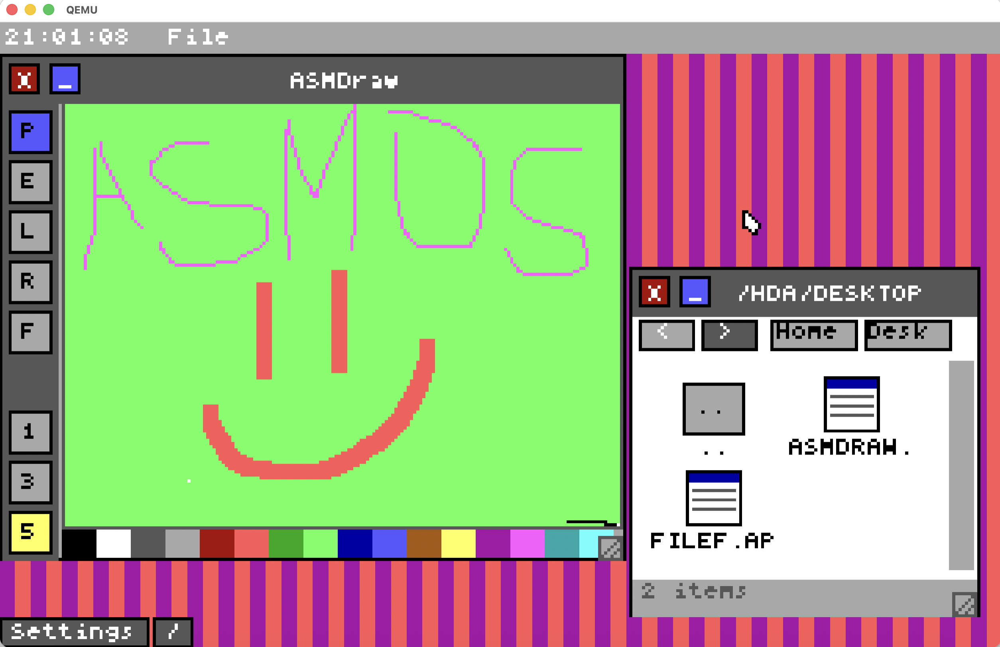

ASMOS - x86 Operating System
Last updated to reflect: v1.3.0
=============================================================================

A 16/32-bit x86 OS built from scratch. Boots only in QEMU and Bochs; no real hardware yet. :(
Full source code in assembly and C, no external kernel libraries.

[>>> CLICK HERE FOR MY HONEST MESSAGE ABOUT THIS PROJECT <<<](#message-from-me) 

BUILD AND RUN
=============================================================================

Build:
  make

Run in QEMU (with floppy support):
  make qemu-fdd

Run in QEMU (standard):
  make qemu

Run in Bochs:
  make bochs

Clean build artifacts:
  make clean

BOOT SEQUENCE
=============================================================================

Stage 1 (boot.asm, 512 bytes)
  - Real mode, 16-bit x86
  - BIOS loads sector 0 to 0x7C00
  - Sets up stack at 0x7000
  - Loads Stage 2 (sectors 1-8) to 0x7E00
  - Loads kernel (sectors 9-1008) to 0x8000
  - Uses LBA-to-CHS conversion for BIOS INT 13h
  - Handles flaky real hardware with retry logic
  - Reads video mode flag from 0x0602 to decide between Mode 13h or Mode X

Stage 2 (boot_stage2.asm, ~4KB)
  - Real mode, 16-bit x86
  - Sets up video: either 320x200 (Mode 13h, linear) or 640x400 (Mode X, planar)
  - Detects extended memory (INT 15h AH=88h), stores total RAM at 0x0500
  - Enables A20 line (tries BIOS, then KBC method, then fast method)
  - Loads GDT and switches to 32-bit protected mode
  - Jumps to 32-bit kernel entry (0x10000)

Loader (loader.asm, 32-bit)
  - Sets up flat memory model (16-bit selectors map to full 4GB)
  - Clears BSS section
  - Sets up kernel stack (64KB, just below VGA at 0xA0000)
  - Calls kmain()

Kernel (kernel.c)
  - Detects screen resolution from stage 2
  - Sets up heap (between kernel BSS and stack)
  - Initializes IDT (interrupt descriptor table)
  - Initializes PS/2 (keyboard and mouse)
  - Initializes GPU (direct VGA/VESA access)
  - Mounts filesystem (FAT16)
  - Initializes sound (SoundBlaster 16, OPL2 FM)
  - Optionally initializes networking (NE2000)
  - Sets up window manager and desktop
  - Loads and runs applications

MEMORY MAP
=============================================================================

0x00000 - 0x00FFF    Real mode IVT / BDA
0x01000 - 0x06FFF    Available
0x07C00 - 0x07DFF    Stage 1 bootloader
0x07E00 - 0x08FFF    Stage 2 bootloader
0x10000 - 0x87FFF    Kernel (text, data, BSS, heap)
0x88000 - 0x97FFF    Kernel stack (64KB)
0xA0000 - 0xBFFFF    VGA/VESA framebuffer

VIDEO MODES
=============================================================================

Mode 13h: 320x200, 8bpp, linear framebuffer at 0xA0000
  - Set via int 0x10 AH=00, AL=0x13
  - Easier to work with for me, faster
  - Standard for early DOS era

Mode X: 640x400, 16 color, planar (4 planes), framebuffer at 0xA0000
  - VGA hardware hack I found on some obscure website that I fed into the AI to spit out the current implementation - not terrible, but not perfect either
  - Runs a little bit slower
  - Boot stage selects mode via byte at 0x0602

FILESYSTEM
=============================================================================

FAT16 filesystem mounted during boot. Supports:
  - Reading files
  - Creating files and directories
  - Multiple storage devices (ATA, floppy drive)

Bootloader expects:
  - Kernel in first 1000 sectors (starting at sector 9)
  - BPB at standard offset (offset 3, see boot.asm for layout)

INTERRUPTS
=============================================================================

IDT set up to handle:
  - Page faults (division by zero, etc.)
  - General protection faults
  - Double faults
  - Timer tick (PIT)
  - Keyboard (PS/2)
  - Mouse (PS/2)

All interrupt handlers written in assembly. Generic handlers call C code. That's all I could understand and implement with the help of AI.

SCHEDULER
=============================================================================

Simple round-robin scheduler. Supports:
  - Multiple tasks/processes
  - Context switching via task_switch.asm
  - Task registry with entry points
  - Kernel tasks run with full privileges

Not preemptive in the strict sense - relies on timer interrupts. Mac OS 4 or 6-era like because one bad task f###s the whole OS.

WINDOWING SYSTEM
=============================================================================

Basic desktop environment with:
  - Window manager (WM)
  - Mouse cursor support
  - Menubar at top
  - Desktop (icon-based)
  - Modal dialogs
  - Basic widget library (buttons, text input, etc.)

All drawing to a back buffer, then blitted to video memory.
Supports both video modes theough the "high performance complex" gpu driver.

DRIVERS
=============================================================================

GPU (gpu.c):
  - Direct VGA register access
  - Framebuffer setup for both modes

NE2000 (ne2000.c):
  - ISA ethernet card
  - Packet transmit/receive
  - Interrupt-driven

SoundBlaster 16 (sb16.c):
  - PCM audio
  - DMA transfers
  - IRQ detection

OPL2 (opl2.c):
  - FM synthesis chip
  - MIDI-like note on/off
  - Instrument patches

FILESYSTEM DRIVERS
=============================================================================

ATA (fs/ata.c):
  - IDE/ATA hard drive support
  - PIO mode (no DMA)
  - INT 13h for CHS access

Floppy Drive (fs/fdd.c):
  - 3.5" floppy drive support
  - 1.44MB standard format
  - INT 13h

APPLICATIONS
=============================================================================

All bundled applications are single-window GUI apps.

Calculator (calculator.c)
  - Basic math (+, -, *, /)
  - Display buffer

Text Editor (teditor.c)
  - Simple line-based editor - notepad-like
  - File load/save via filesystem

File Manager (filef.c)
  - Browse FAT16 filesystem
  - File copy, delete, view properties

Hex Viewer (hexview.c)
  - Display binary files in hex
  - Scroll through file

Clock (clock.c)
  - Realtime clock display
  - PIT-based timer

Monitor (monitor.c)
  - CPU info
  - Memory stats
  - Interrupt counters

Settings (settings.c)
  - Toggle sound/networking
  - Configure IP address
  - Save/load config

MIDI Player (midiplayer.c)
  - Plays .MID files via OPL2
  - Basic MIDI event parsing

ASM Terminal (asmterm.c)
  - Debug shell
  - Hex viewer
  - Memory inspector

ASM Draw (asmdraw.c)
  - Pixel art editor
  - Simple brush tools

Clipboard Viewer (clipview.c)
  - View system clipboard contents

SHELL
=============================================================================

Command-line interface (shell/cli.c) with basic commands:
  - ls, cd, pwd
  - mkdir, rm, cp
  - exit, help
  - more

Runs if not starting in GUI mode (controlled by runtime config).

CONFIGURATION
=============================================================================

Runtime config stored as INI-style file in FAT16 filesystem.

Options:
  - GUI vs CLI on boot
  - Audio enable/disable
  - Networking enable/disable
  - Static IP configuration
  - DNS server
  - Boot chime on/off
  - More

Config file parsed at startup. Defaults used if file missing or corrupted.

HARDWARE REQUIREMENTS
=============================================================================

Minimum (to boot and run CLI):
  - 386 or better CPU
  - 2MB RAM (really could work with less >=1.4MB, 4MB recommended)
  - Floppy drive or hard drive (or IDE emulation in QEMU)
  - VGA card

Optional (for full features):
  - SoundBlaster 16 or compatible (for PCM audio)
  - OPL2 FM synthesis card (for MIDI)
  - NE2000 ISA ethernet card (for networking)

Tested on:
  - QEMU i386 (with various device options)
  - Bochs emulator
  - Real 486/Pentium hardware (ISA-bus systems) - shows a red line and resets

KNOWN LIMITATIONS
=============================================================================

- No preemptive multitasking (cooperative scheduling)
- FAT12/FAT16 only (no NTFS, ext2, etc.)
- No protected mode task switching (all apps run in ring 0)
- Sound is PC speaker beep only if no SoundBlaster detected
- No virtual memory (no paging beyond what stage 2 sets up)
- No USB support (ISA devices only)
- Limited error recovery (disk errors print message and halt)

BUILDING A BOOTABLE IMAGE
=============================================================================

The makefile generates os_image.bin (65536 sectors = 31-32MB disk).

Layout:
  Sector 0:     boot.asm (512 bytes)
  Sectors 1-8:  boot_stage2.asm (~4KB)
  Sectors 9+:   kernel.bin (up to 1000 sectors)

To write to a USB drive (be careful!):
  dd if=os_image.bin of=/dev/sdX bs=512

To write to a floppy image:
  dd if=boot.bin of=floppy.img bs=512 seek=0 count=1
  dd if=boot_stage2.bin of=floppy.img bs=512 seek=1 count=8
  dd if=kernel.bin of=floppy.img bs=512 seek=9

DEVELOPMENT NOTES
=============================================================================

Code style:
  - Minimal comments (code is readable enough on its own) - I hate writing comments, plus I always delete the AI-written ones
  - Assembly uses AT&T syntax in inline asm, NASM syntax in .asm files
  - C89 compatible (no C99 features except where necessary)
  - No dynamic memory allocation in performance-critical paths

Debugging:
  - Use bochs with debugger for step-through
  - gdb can attach to QEMU via port 1234 (add -gdb tcp::1234 to qemu command)
  - Add debug prints via draw_string() to see what's happening in the gui

Testing new code:
  - Small test apps in apps/ can be created as standalone processes
  - Use settings app to toggle features on/off without rebuild
  - Most hardware detection is non-fatal (gracefully degrades)

SOURCE TREE
=============================================================================

boot.asm, boot_stage2.asm, loader.asm     Boot stages and loader
kernel.c                                   Main kernel entry
linker.ld                                  Linker script

os/                   Core OS (scheduler, tasks, error handling)
interrupts/           IDT setup and interrupt handlers
io/                   PS/2 keyboard and mouse
drivers/              Hardware drivers (GPU, sound, NIC)
fs/                   Filesystem and storage drivers
ui/                   Window manager, desktop, widgets
shell/                CLI shell and commands
apps/                 Bundled applications
lib/                  Utility libraries (memory, string, time, etc.)
config/               Runtime configuration
fonts/                Font data for text rendering
network/              TCP/IP stack, DNS, Gopher client

MESSAGE FROM ME
=============================================================================

Thanks for checking this out! I admit I used AI (60% of all of the code is generated by Claude, Gemini and stolen from some guys on forums), but I checked it thoroughly and searched for fatal bugs. I don't consider this a vibe-coded project. I say it's the work of a human (me) assisted by AI for certain stuff. Could I have written all of this myself? Probably - with a 25% success rate. How much would it have taken me? Well, it's been 4 months since I started this project. Without AI, I would probably be stuck writing a working memory allocator and to get to this level, I'd have looked forward to a little over 2-3 years, provided I did not lose any interest along the way. I also read 'The Little Book about OS Development' by Erik Helin & Adam Renberg, 'The C Programming Language' by Brian Kernighan & Dennis Ritchie, 'PC Assembly Language' by Paul A. Carter and some Linux documentation to actually understand the concept of all of the things in this OS.
